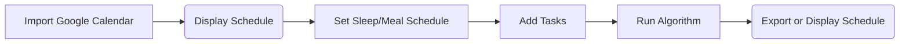

# Meeting Notes | 2021-09-27 | Week 4 
*By T. Vercoelen*

## Sprint Planning
This week we aim to connect the google agenda, implement a first version of the GUI and start work on the planning algorithm.

### Back End
- Teus will finish the code for importing events from the google calendar before wednesday.
- Work on the sorting algorithm can also be started this week. A seperate python file will be made for this.

### Front End
- Robin will merge the code for the task class and task creation before this wednesday.
- Achere has started work on the main python file. The main file will open the main window. From this window the event and task classes will be called and the functions will be coordinated.
- Tabs will be implemented in the GUI. 

### General
- Sessions within tasks have been simplified. They now have the same duration.
- Decisions will be made on how to test the program. The GUI will be tested manually with proof by means of screen recording. The majority of testing will happen at the back end. 

# Meeting Notes | 2021-09-29 | Week 4 
*By T. Vercoelen*

## TA Meeting
### What we've been up to this week
- Connecting the GUI to the task creation.
- Importing events from the google agenda is now working.
- We're closer to fixing the pipeline failure.

### Feedback from Agata
- Improve on merge requests; more indept descriptions.
- Improve the file structure; make it more organized by use of folders.

## Meeting Afterwards
- Overleaf file made for the report due on saturday, October 9th, 2021.
- Discussed the flow of user input when using the program.

- Discussed the UI and what to add to it.
- Discussed the plan, Nina and Hashim came up with, for how the algorithm will funtion.
- Decided to prioritize the upcoming python exam over working on the project.

# Meeting Notes | 2021-10-01 | Week 4 
*By T. Vercoelen*

## Sprint Review
### What was accomplished this week
- Close to finishing the task creation.
- Main window in GUI is almost done.
- Importing events from google now works.
- Almost fixed the pipeline.

### What went well
- Managed the task load well with respect to the load of the exam(s).
- We are starting to see the fruits of our labor.

## What could get better
- We have not started on testing yet. We should start with this as soon as possible.
- We lack quite some documentation for the code we have produces. We should make up for this next week.
- We have not started on the report yet. The deadline is next week saturday. This is a priority for next week's sprint.

